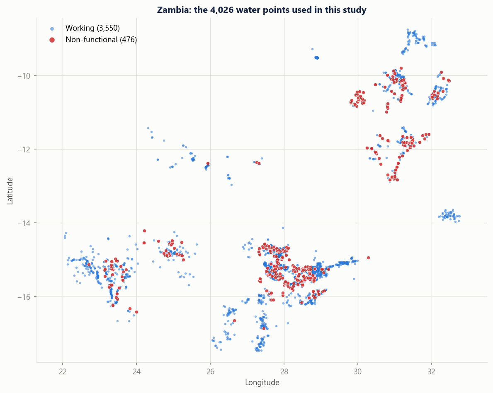
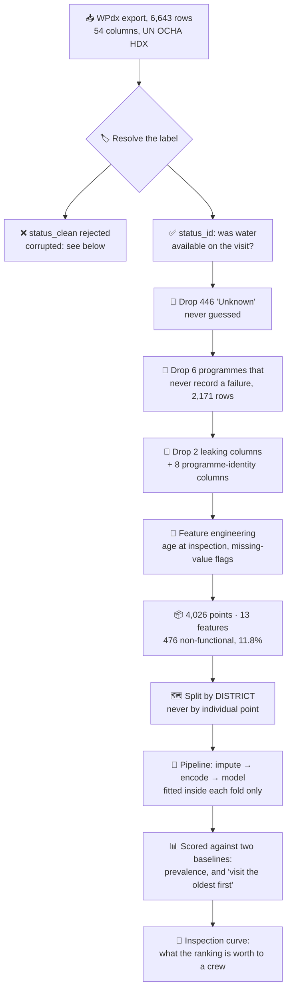
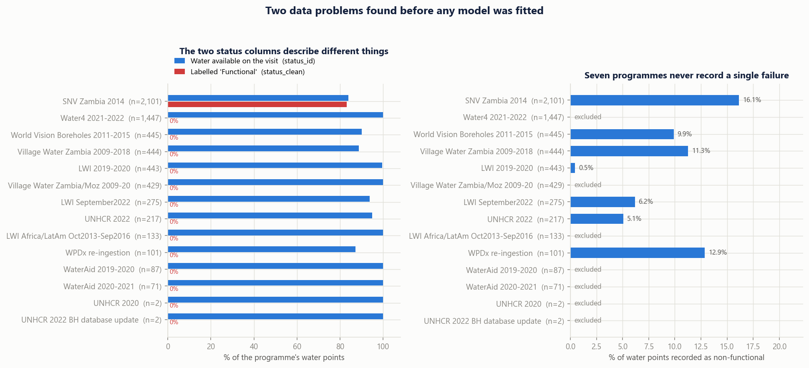
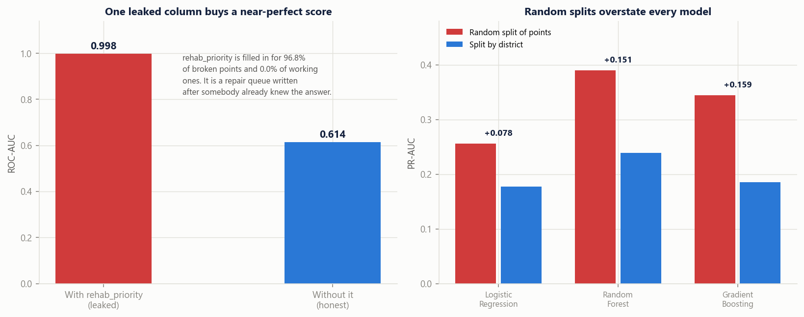
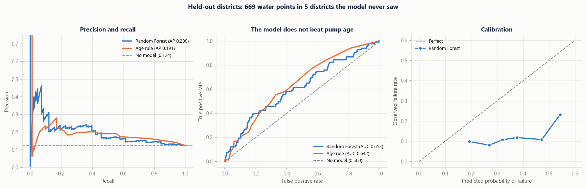
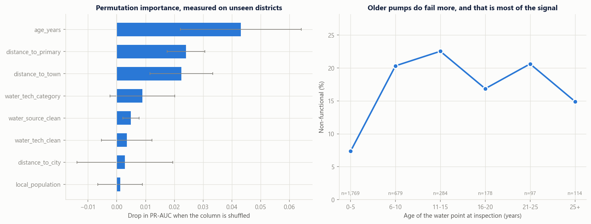
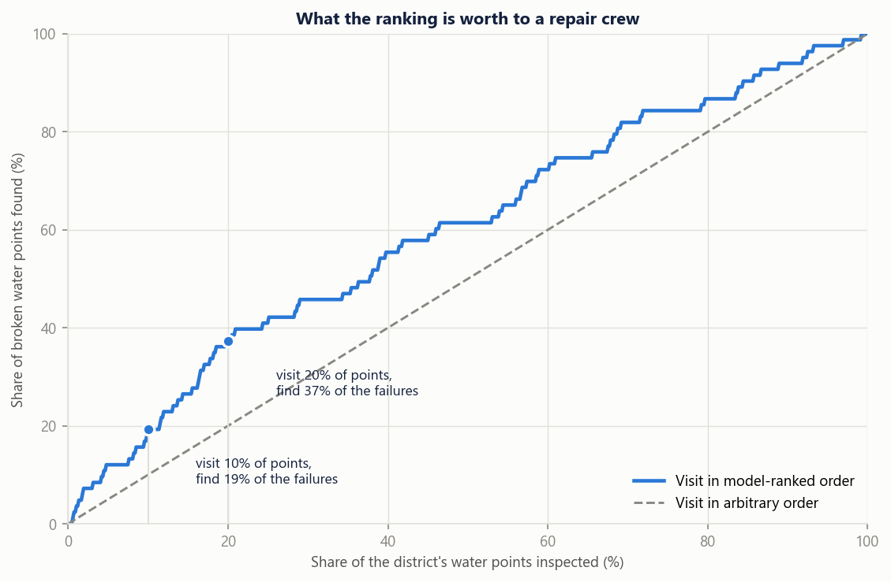

# 💧 Which Water Points Are Broken? A Failure Model for Rural Zambia

     

> **4,026 rural water points across 61 Zambian districts. One in eight was dry on the day somebody walked to it.** This project asks whether the ones that will fail can be identified in advance, and answers honestly: only a little, and almost entirely because of how old the pump is.

The headline result of this project is not a score. It is that **three separate things in the data would each have produced a model that looked excellent and predicted nothing**, and that finding them is most of the work.

---

## 🗺️ The data



Every point is a real well, borehole or tap stand, recorded by a field enumerator between 2012 and 2022, with GPS coordinates, installation year, water source, pump technology, and whether water actually came out on the day of the visit.

The data comes from the **[Water Point Data Exchange](https://www.waterpointdata.org/)**, published through the **[UN OCHA Humanitarian Data Exchange](https://data.humdata.org/dataset/wpdx_zmb)**. Nothing here is simulated.

---

## 🧨 The problem this solves

A borehole that stops working does not announce it. In rural Zambia the failure is discovered by the people who walked to it, and it is fixed when somebody with a vehicle, a pump part and a budget happens to hear about it. Between those two moments, a village goes back to unsafe water.

**SDG 6.1** commits to universal, equitable access to safe drinking water by 2030. In practice the binding constraint is rarely building new water points. It is that a large share of the ones already built are not working, and nobody knows which ones until somebody checks.

A district water officer has one vehicle, a small crew and several hundred water points. The question is not "what is the average failure rate." It is **"which ones do I drive to first."**

That is a ranking problem, and ranking is something a model can do even when it cannot classify confidently.

---

## 🔍 What the project does



| Stage | File | What happens |
|---|---|---|
| 1 | [`src/data_prep.py`](src/data_prep.py) | Resolves the label, drops leaking and programme-identity columns, engineers age at inspection. Every exclusion carries a written reason and is printed at run time. |
| 2 | [`src/ablation.py`](src/ablation.py) | Tests five feature sets against three model families on training districts only, to decide what actually earns its place. |
| 3 | [`src/train.py`](src/train.py) | Grouped cross-validation, model selection, the leakage demonstration, the split-optimism comparison, bootstrap confidence intervals, permutation importance. |
| 4 | [`src/evaluate.py`](src/evaluate.py) | Six figures, on a colour-vision-validated palette. |

---

## 🧪 Three things in the data that would each have faked a good model



### 1. The obvious label column is corrupted

`status_clean` looks like the answer. It holds exactly two values, `Functional` and `Non-Functional`, and it is never missing. It is also unusable.

Of the fifteen contributing programmes, **exactly one ever records the value `Functional`**. Every other programme has all of its water points labelled `Non-Functional`, including programmes where the separate field-observation column says water was available at 100% of them. Village Water's Zambia and Mozambique survey contributes 429 points: all 429 are marked `Non-Functional`, and all 429 recorded water flowing.

It is a missing value that was written as a category. A model trained on it would learn to recognise **which NGO uploaded the record**, and would score well doing it.

The column actually used is `status_id`: did water come out of this water point on the day an enumerator stood in front of it. The 446 points recorded as `Unknown` are dropped rather than guessed, because assigning them to either class would invent 446 observations that nobody made.

### 2. A column that fills itself in only for broken pumps

`rehab_priority` is a rehabilitation queue. It is populated for **96.8% of non-functional water points and 0.0% of functional ones**, because it is written after somebody has already established that the pump is broken.

Leaving it in is not a subtle mistake. Here is what it buys:



**ROC-AUC 0.998.** A model that appears to solve rural water infrastructure and has in fact learned that a field is filled in. `would_gain_access` behaves the same way, at 99.6% against 0.0%.

### 3. Seven programmes that never record a single failure

Failure rates by contributing programme run from 0.0% to 16.1%. That range is not geography. Seven of the fourteen programmes, covering 2,171 water points, report **no failures at all**, because they upload points at handover, when everything works by definition.

Keep them, and a model can predict failure from programme identity, reaching it indirectly through district, installation year and pump type. Those 2,171 points are excluded, and the exclusion is applied before anything is fitted.

---

## 🗺️ Why the model is tested on districts it has never seen

Water points in the same district share an installer, a water table, a spare parts supply and a maintenance team. Split those points at random and near-copies of the same water point land on both sides of the split, so the model is being asked to recognise a neighbourhood it has already studied.

Every number in this project is produced by **`StratifiedGroupKFold` grouped on district**. The held-out set is five entire districts, 669 water points, that the model has never encountered.

The right-hand panel above is what that choice costs on paper:

| Model | Random split of points | Split by district | Overstated by |
|---|---|---|---|
| Logistic Regression | 0.256 | 0.177 | **+0.078** |
| Random Forest | 0.390 | 0.239 | **+0.151** |
| Gradient Boosting | 0.344 | 0.185 | **+0.159** |

A random split makes the Random Forest look **63% better than it is**. Both numbers come from the same model, the same features and the same data. Only the splitting rule changed.

---

## 📊 What the model actually achieves



On 669 water points in five unseen districts, 83 of them broken:

| Metric | Random Forest | 95% CI | Reference |
|---|---|---|---|
| **PR-AUC** | **0.200** | [0.144, 0.284] | 0.124 if you guess at random |
| **ROC-AUC** | **0.613** | [0.543, 0.678] | 0.500 if you guess at random |
| Brier score | 0.170 | | |

Better than chance, with the confidence interval clear of it. Nowhere near good enough to decide anything on its own.

---

## ⚖️ The honest verdict: one line of arithmetic does just as well

The model was compared against the rule a planner would use without any of this: **visit the oldest pumps first.**

| | PR-AUC | ROC-AUC |
|---|---|---|
| Random Forest, 13 features | 0.200 | 0.613 |
| `sort by age, descending` | 0.191 | **0.642** |

The age rule *wins on ROC-AUC*. The ablation in [`src/ablation.py`](src/ablation.py) says the same thing from the other direction: age alone scores PR-AUC 0.220 against 0.227 for all fifteen features, and every difference in the table is comfortably inside one standard deviation of the fold-to-fold noise.



Permutation importance, measured on the held-out districts rather than from tree impurity, agrees: `age_years` carries roughly twice the weight of anything else, and everything below the third row is indistinguishable from zero.

**So the honest finding is that this dataset supports a weak age-driven ranking and not much more.** Fourteen additional columns add nothing that survives the trip to a new district. Reporting that is the point. It would have been easy to publish the 0.998.

---

## 🚰 What it is still worth

A weak ranking is not a useless one, provided you ask it the operational question instead of the accuracy question.



| Crew visits | Points | Broken found | Share of all failures | vs. arbitrary order |
|---|---|---|---|---|
| Top 5% | 33 | 10 | 12% | **2.4x** |
| Top 10% | 67 | 16 | 19% | **1.9x** |
| Top 20% | 134 | 31 | 37% | **1.9x** |
| Top 30% | 201 | 38 | 46% | 1.5x |

Inspect a fifth of a district in model-ranked order and you find **37% of its broken water points**, close to twice what the same fuel and the same crew would find visiting in an arbitrary order.

That is a real gain and a modest one, and it is the correct size to report. A district officer choosing between "drive around" and "drive around in this order" is the decision this can actually support. Anything stronger needs better data, which is the next section.

---

## 🎓 What changed since my last ML project

I audited my five earlier ML repositories in August 2026 and every one of them had a methodological defect. This project was built to not repeat them.

| Then | Now |
|---|---|
| `HDP` reported 99.5% accuracy because the target column was left in the features | Two leaking columns identified, quantified, and **demonstrated** rather than quietly dropped: 0.998 against 0.614 |
| `Insurance` reported R² on data it had trained on, with no split | Whole districts held out, plus 5-fold grouped cross-validation, plus bootstrap confidence intervals |
| `Confusion-Matrix` compared a decision tree against itself, a variable-naming slip | Every model runs through the same `cross_validate` function against two named baselines |
| Transforms applied to the full dataset before splitting | Imputation and encoding live inside a `Pipeline`, fitted per fold, so leakage is structurally impossible |
| Feature importance read off tree impurity | Permutation importance on held-out districts, with standard deviations |
| Whatever score came out was the result | The model is measured against a one-line heuristic, and reported as barely beating it |
| One notebook | Four scripts that run end to end, versioned data, saved metrics, a model card |

---

## 🧠 What I learned

- **The cleanest-looking column is the one to distrust.** `status_clean` had two tidy values and zero missing entries. `status_id` was messier and was the real observation. Tidiness in a field dataset usually means somebody filled the gaps, and the filling is what you would be modelling.
- **Check missingness by class before checking correlation with the target.** `rehab_priority` is 96.8% present for one class and 0.0% for the other. That single comparison found the leak in seconds, and it would have found the target leak in my old heart-disease notebook too. It is now the first thing I run.
- **Ask who produced each row, not just what it says.** The 0% failure rates were not a data quality problem to be cleaned. They were six organisations with a different upload convention, and no amount of imputation would have fixed the bias they introduce.
- **A grouped split is not a formality.** It moved the Random Forest from 0.390 to 0.239. If a model is going to be used in a district it was not trained on, that is the only number that was ever real.
- **Beat the boring baseline or say that you did not.** Sorting by age took one line and won on ROC-AUC. Knowing that changes the recommendation from "deploy this model" to "use pump age and go and collect better data," which is a more useful thing to tell somebody.
- **Colour is a correctness question, not a taste question.** The intuitive green-for-working, red-for-broken pair fails deuteranopia separation badly, at a colour distance of 4.1 where 8 is the floor. Roughly 8% of men would not be able to read the map in this README. Blue and red carry the same meaning and separate cleanly, and it cost nothing to check.

---

## ⚠️ Known limitations and next steps

- **The result is a weak ranking, not a decision tool.** ROC-AUC 0.613 with a lower confidence bound of 0.543. It is suitable for ordering inspection visits and unsuitable for anything that affects an individual community's funding.
- **The model is poorly calibrated.** `class_weight="balanced"` shifts the predicted probabilities upward, so the third panel of the performance figure sits well below the diagonal. The ranking is usable; the numbers should not be read as probabilities. Fitting a `CalibratedClassifierCV` on a held-out district fold is the fix and is not done here.
- **One observation per water point, and no maintenance history.** This is a snapshot, not a panel. The genuinely predictive variables for pump failure are almost certainly the ones nobody recorded: how deep the water table is, whether a village committee collects a tariff, how far the nearest spare part is, and when it was last repaired. Their absence is the most likely explanation for why age is all that is left.
- **Records span 2012 to 2022 and are treated as one cohort.** A 2014 census and a 2022 survey sit in the same training set. A time-aware split would be more honest still, but with 476 failures there is not enough data to hold out a period as well as a set of districts.
- **476 failures across 61 districts is a small positive class.** Fold-to-fold standard deviation runs to 0.15 PR-AUC. Differences between the models in this repo are not statistically meaningful, and I have not claimed they are.
- **The excluded programmes may contain real information.** Dropping every programme with a 0% failure rate is a defensible choice, but it is a choice conditioned on the target, and a reviewer is entitled to push back on it. The alternative, keeping them and grouping the cross-validation by programme as well as district, is the first thing I would try next.
- **Four WPdx service-allocation columns were excluded conservatively.** `assigned_population`, `pressure`, `criticality` and `usage_cap` showed balanced missingness across classes and near-zero correlation with the target, so they are probably safe. They were dropped anyway because the allocation logic is not documented well enough to rule out that it knows which points work.
- **Coordinates were dropped on the evidence of the ablation**, which used five folds. That is thin evidence for a structural decision, and repeated cross-validation would put it on firmer ground.

---

## 📥 Reproduce it

```bash
git clone https://github.com/buseko-Actuary/sdg6-zambia-water-points
cd sdg6-zambia-water-points
pip install -r requirements.txt
python src/data_prep.py
python src/ablation.py
python src/train.py
python src/evaluate.py
```

The raw export is committed, so the pipeline runs offline and every number in this README is reproducible. To refresh it from source, download `wpdx_water_points_zmb.csv` from the [HDX dataset page](https://data.humdata.org/dataset/wpdx_zmb) into `data/raw/`.

Every random seed is fixed at 42.

---

## 🗂️ Repo layout

```
├── data/
│   ├── raw/            WPdx export, committed for reproducibility
│   └── processed/      modelling table + programme failure rates
├── src/
│   ├── data_prep.py    label resolution, exclusions, feature engineering
│   ├── ablation.py     which features earn their place
│   ├── train.py        grouped CV, leakage demo, held-out evaluation
│   └── evaluate.py     figures
├── reports/
│   ├── figures/        the six figures in this README
│   ├── metrics.json    every number quoted above
│   ├── ablation.csv
│   └── permutation_importance.csv
├── models/             the fitted pipeline
└── MODEL_CARD.md       intended use, and what this must not be used for
```

---

## 📚 Data source and licence

Water Point Data Exchange, *WPdx+ Zambia water point data*, accessed 3 September 2026 via the UN OCHA Humanitarian Data Exchange: <https://data.humdata.org/dataset/wpdx_zmb>

The dataset is published under **Creative Commons Attribution Share-Alike**. The copy in `data/raw/` is redistributed unchanged under those terms, and any redistribution of it must carry the same licence and attribution. **The code in this repository is MIT licensed.** See [`DATA_LICENCE.md`](DATA_LICENCE.md).

WPdx is a collaboration of national governments, NGOs and researchers. The Zambian records here were contributed by SNV Zambia, World Vision, Village Water, Living Water International, UNHCR, WaterAid and Water4, among others. The analysis and any errors in it are mine.

## 🛠️ Stack

`Python 3.13` · `scikit-learn` · `pandas` · `NumPy` · `matplotlib` · `joblib`

---
<p align="center"><i>Built in Lusaka. Data that decides where the truck goes tomorrow. · Buseko Fungamwango</i></p>
